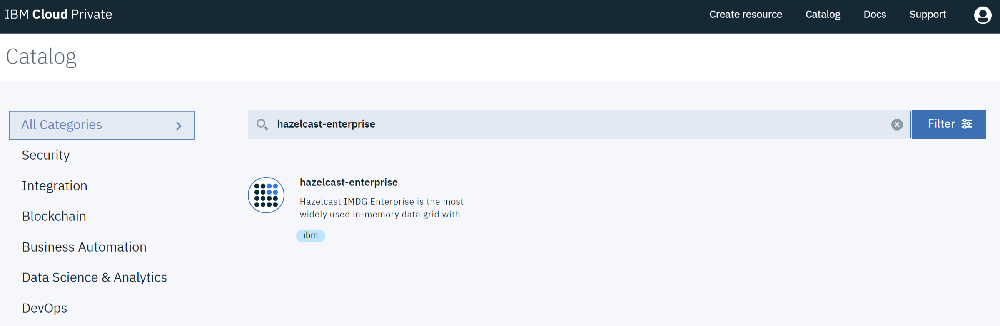
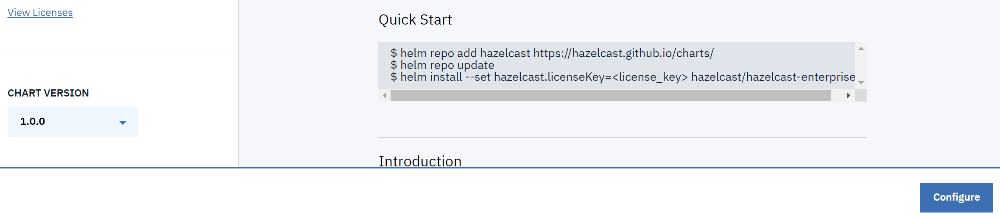
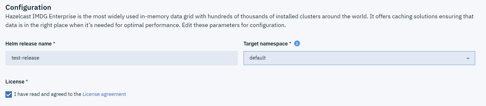
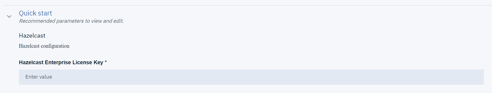
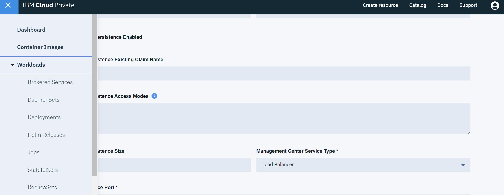
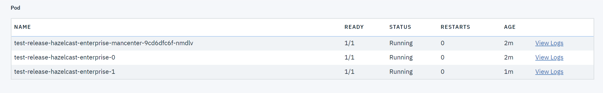
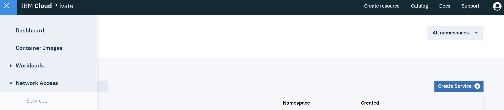
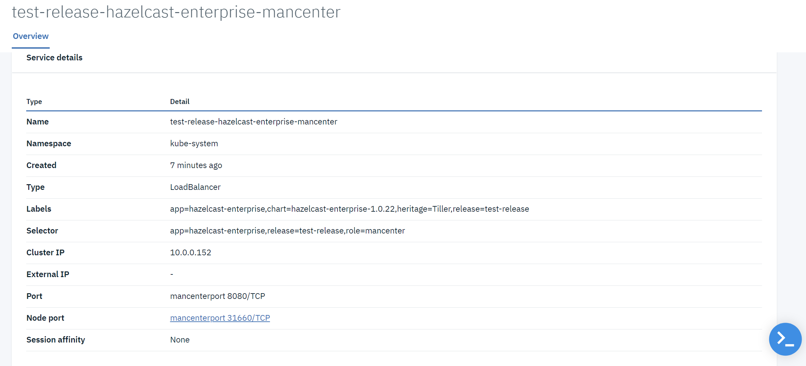
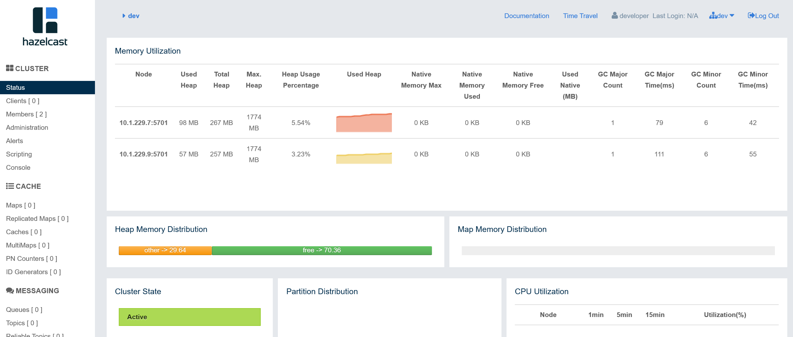

# Instructions for IBM Cloud

These instructions are specifically for IBM Cloud Private ("ICP") and IBM Kubernetes Service ("IKS").

# IBM Cloud Private (ICP)

### Installing Hazelcast

To install Hazelcast on ICP, use the following steps.

1. Click on "Catalog" and click on the "hazelcast-enterprise" Helm Chart



2. Choose the Chart Version and click "Configure"



3. Enter "Helm release name", "Target namespace", and Check "I have read and agreed to the License agreement"



4. Enter "Hazelcast Enterprise License Key"



5. If needed, configure other parameters (e.g. "Member Count" or "Docker Image Tag"); then click "Install", you should see the following message.


### Verifying Hazelcast works correctly

To verify that Hazelcast is installed correctly, follow the steps.

1. Click on "Workloads" and "Helm Releases"



2. Find your Helm release by name and check the logs of PODs, they should be all in the "Running" state



3. When you click on the logs of "hazelcast-enterprise", you should see that members formed a cluster together

```
...
Members {size:2, ver:2} [
        Member [10.1.229.7]:5701 - fbb8b83f-9bb0-4442-80dc-1cc53b8d91d7 this
        Member [10.1.229.9]:5701 - 9fb104dd-6d90-4bbc-b0f8-cd165dc299f3
]
...
```

4. To access Management Center, you can click on "Network Access" and "Services"



5. Then, click select the Management Center service and click on the "Node Port" link (or "External IP" if you have Load Balancer configured for ICP)



6. If the link does not open, then add `/hazelcast-mancenter`

7. After setting up username and password, you should see your Hazelcast cluster



# IBM Kubernetes Service ("IKS")

IKS is a standard Kubernetes service, so to deploy Hazelcast, you need to follow the instructions [here](https://github.com/hazelcast/charts/tree/master/stable/hazelcast-enterprise).

